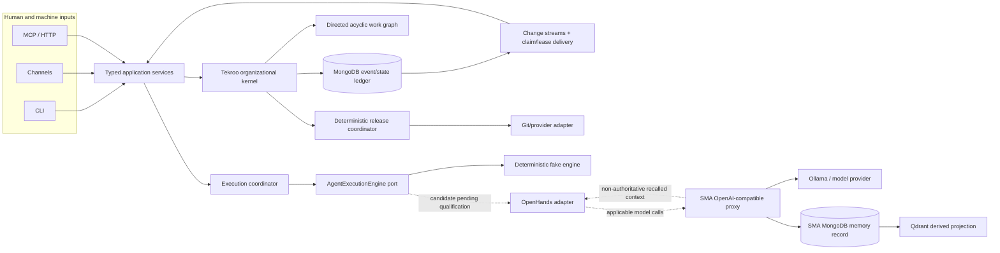

# Tekroo v4 Phase 1B — Final architecture handoff

**Status:** READY FOR FINAL PRINCIPAL GATE  
**Step 8 authorized by principal:** `Begin` on 2026-08-11  
**Implementation authority:** `NONE`  
**Production authority:** `NONE`

## Final conclusion

The approved v4 direction is semantic salvage plus architectural separation.
It is not a Tekroo v3 codebase port, an OpenHands takeover, or an expansion of
SMA into organizational process control.

Tekroo remains the organizational system of record. Its kernel owns durable
actor identity, the versioned catalogue and schemas, the directed acyclic work
graph, stories and tasks, assignment and ownership, authorization, validation,
acceptance, completion, reopening, escalation, release policy, and provenance.
MongoDB remains the approved organizational persistence substrate, including
the efficient change-stream wakeup and cohesive claim/lease mechanics. Execution
providers and SMA remain replaceable components behind explicit ports.

This handoff reconciles 46 salvage candidates, 14 binding negative requirements,
five retained Phase 1A tensions, the kernel claims ambiguity, and the residual
evidence gaps. It defines three bounded investigations but authorizes none of
them to execute.

## Evidence and authority calibration

- **OBSERVED:** All 29 files in the Phase 1A checksum manifest currently match
  their frozen SHA-256 digests.
- **OBSERVED:** Steps 1 through 7 are `PASS_PRINCIPAL_CONFIRMED`, and Step 8 was
  explicitly opened by the principal.
- **COMPUTED:** The final 46-candidate salvage distribution is 2 `PRESERVE`, 9
  `PRESERVE_WITH_WRAPPER`, 18 `REFACTOR`, 9 `REIMPLEMENT`, 3 `DISCARD`, 2
  `INVESTIGATE_FURTHER`, and 3 `DEFER_OUT_OF_SCOPE` after applying Step 7's
  claims-package resolution.
- **PRINCIPAL-APPROVED:** All 14 negative requirements are `ADOPT`.
- **UNKNOWN / UNQUALIFIED:** OpenHands production behavior and advanced SMA
  behavior remain unproven; static source and bounded probes do not qualify them.

## Approved architecture

### 1. Organizational kernel

The kernel accepts typed commands and evidence, validates authority, catalogue,
schema, causal references, expected revisions, and policy, then commits one
durable organizational transition. Provider, transport, API, CLI, and storage
representations are projections or adapters; none may create organizational
truth directly.

The immutable event lineage is a directed acyclic graph. Causal, response,
retry, derivation, and supersession edges point forward to new nodes and may not
introduce cycles. Independent validation branches join deterministically.
Retries, planning revisions, task expansion, handoffs, escalation, completion,
and reopening have explicit finite policy and stable outcomes.

### 2. Identity, ownership, and execution

The durable actor identity is the existing FQN, such as `teams::coder-1`.
Restarting that actor creates a new provider-neutral `ExecutionId` and fencing
epoch, not a new actor. Provider session IDs, processes, workspaces, credentials,
and locks are execution provenance.

Four meanings remain distinct:

1. directed dispatch or routing intent;
2. durable task ownership recorded as an exact actor FQN and ownership version;
3. temporary message-delivery claim and lease;
4. execution lease, process authority, and fencing.

A role-wide request does not establish ownership. An exact actor accepts through
an idempotent compare-and-set task transition. Message redelivery, claim expiry,
process death, or a new execution cannot silently reassign the task. There is no
separate work-claim aggregate; the empty v3 `internal/claims` package is
discarded.

### 3. Catalogue, messages, and protocol integrity

V4 uses a versioned catalogue with explicit schema versions, aliases,
deprecations, compatibility intervals, and deterministic routing. Exact directed
recipients are preferred. Broader role or wildcard routing must be explicit and
testable.

Unknown message types are retained losslessly but cannot create canonical
organizational effects. No alias is adopted for `tekroo-agent-chat`,
`tekroo-agent-ping`, or `tekroo-agent-pong`. V4 will define its directed
communication contract deliberately rather than inheriting those historical
names by frequency. Future aliases require explicit semantic evidence,
transformation, approval, replay, and rollback rules.

### 4. State, MongoDB, hooks, and delivery

MongoDB remains the organizational state and event substrate. Preserve the
change-stream wakeup, stream-open-before-backlog ordering, direct Mongo access,
atomic one-winner delivery claims, monotonic claim epochs, leases, bounded
resume, sweepers, readdressing, dead letters, and optimized state queries.

Do not replace this path with polling, a generic queue, or a generic database
abstraction without measured correctness or performance evidence. The state
wrapper enforces Tekroo write authority and provenance; it is not permission to
replace MongoDB.

Refactored hooks separate pre-acceptance policy, domain transition, durable
commit, and idempotent post-commit effects. Post-commit failures remain visible
and retryable without reversing an accepted transition or duplicating effects.

### 5. Completion, acceptance, and release

`CompletionRequested` is evidence submitted by an actor or adapter. `Completed`
is emitted only by the kernel after the authoritative durable transition.
Completion closes a revision or lifecycle epoch; later work is late evidence,
an authorized linked reopening, a successor/correction node, or a rejected
operation against a closed revision.

Release uses a deterministic coordinator. Persist the ordered release plan,
exact repository/base/PR identities, policy revision, and idempotency key before
external execution. Reconcile provider state after timeout, cancellation, or an
ambiguous result. Record partial multi-PR outcomes explicitly. Organizational
acceptance follows only after every required merge is authoritatively verified.

The canonical build gate qualifies the exact synthesized merge tree and records
base/head commits, resulting tree, toolchain, dependency lock, gate-definition
version, and artifacts. Local development, CI, merge qualification, and release
consume the same versioned manifest. Hermetic, deterministic-scenario, and paid
or provider-backed gates remain separate.

### 6. Execution-provider boundary

`AgentExecutionEngine` defines provider-neutral start, stop, inspect, and
reconcile operations. A kernel-owned execution coordinator controls durable
authorization-before-start, explicit execution states, idempotency, fencing,
restart eligibility, instance limits, anti-thrash policy, and ambiguous-start
reconciliation.

The deterministic fake engine is the bootstrap reference. OpenHands is only an
investigation candidate. Its `FINISHED`, errors, tool exits, events, and model
statements are execution evidence and cannot complete, fail, reassign, or kill
organizational work directly.

Untrusted execution requires a pinned isolated remote/container workspace with
filesystem, network, process, resource, secret, artifact, confirmation-policy,
and timeout controls outside the provider runtime. Host `LocalWorkspace` is not
an approved untrusted-execution boundary.

### 7. SMA semantic-memory boundary

SMA is semantic memory only. It does not own workflow state, process control,
task auditing, acceptance, authority, or organizational outcome measurement.

The approved automatic path is an OpenAI-compatible SMA proxy between applicable
OpenHands model roles and Ollama or another configured model provider. It
retrieves bounded, partitioned, explicitly non-authoritative recollection and
captures raw exchanges through durable idempotent asynchronous intake. Retrieval
or capture degradation does not block inference; authorization and partition
isolation fail closed. SMA-internal cognitive calls bypass normal capture and
retrieval to prevent recursion.

Actor attribution derives from authenticated configuration and durable FQN,
not untrusted request text or OpenHands workspace identity. Current authorized
instructions and current source/test/runtime evidence outrank recalled context.

MongoDB is SMA's document system of record. Qdrant is a derived, rebuildable
projection with explicit embedding producer, model/revision, dimensions,
normalization, distance metric, source memory, and source revision. Contradictory
memories and provenance are retained; a contradiction edge is a semantic
hypothesis, not a truth or process decision.

Replay, pressure, lifecycle, contradiction processing, consolidation, vector
retrieval quality, and training are not production-proven. Level 2 training is
deferred and disabled; automatic memory export is prohibited.

### 8. Adapters and supporting surfaces

CLI, API, public API, HTTP, stdio, channels, and daemon hosts are thin adapters
or composition roots over typed application services. They perform no direct
organizational persistence and carry FQN, `ExecutionId`, fencing, authorization,
idempotency, and provenance. Every asynchronous operation completes or fails
observably under a timeout.

Role libraries are immutable, versioned, content-addressed bundles with real
signature verification, typed capabilities, deterministic dependency resolution,
and pre-activation validation. Provider rendering remains adapter-specific.
Starter role content is reimplemented selectively; prompt text is never the
enforcement boundary.

Runtime disciplines become structured evidence and decision records with
generated human views, not inherited prose authority. Telemetry is reimplemented
under explicit privacy/product policy and never becomes organizational truth.

## Consolidated salvage map

| Domain | `PRESERVE` | `PRESERVE_WITH_WRAPPER` | `REFACTOR` | `REIMPLEMENT` | Other |
| --- | --- | --- | --- | --- | --- |
| Kernel | identity | state; operatormon; release | catalogue; schema; messaging; hooks; registry | audit | claims: `DISCARD` after Step 7 |
| Execution | — | fqnlock; transport; channels; httpmode | channelhost; daemon; stdio | cmd/tekroo-mcp; launch | OpenHands: `INVESTIGATE_FURTHER` |
| SMA | contradiction primitive | memory/provenance contract; vector/model ports | Mongo repositories; MCP intake; provider proxy | OpenHands integration overlay; programming-memory protocol | replay/consolidation: `INVESTIGATE_FURTHER`; Level 2 training: `DEFER_OUT_OF_SCOPE` |
| Supporting | — | — | cmd/tekroo; internal/api; public API; runtime disciplines; module/build; testfixture; testmongo | role library; starter library; telemetry; E2E harness | webhooks and dashboard: `DEFER_OUT_OF_SCOPE`; dashboard UI and premium placeholders: `DISCARD` |

No candidate is authorized for wholesale transplantation. `PRESERVE` still
requires verification against the approved v4 contracts and exact pinned source.

## Fourteen binding negative requirements

1. No indefinite materially similar failed retry without changed-condition
   evidence, finite budget, or escalation.
2. No unbounded or ownerless validation/review.
3. No ordinary work under a completed revision without explicit reopening.
4. No circular handoff or escalation path without accountable ownership and
   finite bounds.
5. No repeated planning without convergence, executable milestone, blocker, or
   explicit stop.
6. No task expansion beyond multidimensional policy budgets without approval.
7. No silent ownership replacement; reassignment is explicit, versioned, and
   traceable.
8. No organizational completion from provider status, successful shell exit,
   or model assertion.
9. No silent coercion of undefined message types or low-confidence aliases.
10. No provider-specific agent/session/prompt/authentication/persistence/tool
    model in the organizational domain.
11. No untrusted execution in an unisolated host workspace or through a control
    bypass.
12. No assumption that cancellation rolls back external effects; use durable
    idempotency and reconciliation.
13. No claim that unexecuted SMA lifecycle, contradiction, consolidation,
    retrieval, or training behavior is production-proven.
14. No causal, handling, quality, or abandonment inference from timestamp,
    recipient, frequency, static overlap, or snapshot non-completion alone.

## Bounded investigation portfolio

### `SMA-Q1-CORE-PROXY-VERTICAL-SLICE`

One pinned OpenHands/SMA/Ollama path, two synthetic actor partitions, and one
preregistered finite corpus. Qualify protocol fidelity, partition isolation,
context integrity, fail-open retrieval, durable capture, provenance, bounds,
streaming, tools, cancellation, and recursion. Inconclusive means no SMA
production-readiness claim and retention of a deterministic no-memory/degraded
route.

### `SMA-Q2-REPLAY-CONSOLIDATION`

Runs only after Q1 establishes reproducible capture and retrieval. Use one
versioned offline corpus, simpler baselines, ablations, held-out semantic and
retrieval evaluation, and a fixed fault matrix. Inconclusive means no advanced
SMA implementation reuse. Level 2 training is excluded.

### `OPENHANDS-Q1-AGENT-EXECUTION-ENGINE`

One clean uniformly pinned isolated stack, one adapter, one preferred local
model route, one fallback, and a finite synthetic scenario manifest. Qualify
fencing, cancellation, uncertainty reconciliation, event delivery, restart,
workspace integrity, security, correctness, cost, latency, and termination.
Inconclusive means OpenHands is not adopted for the bootstrap; the deterministic
fake engine remains the reference.

All three require separate principal authorization before execution. A passing
result creates eligibility for a later adoption decision, not production
authority.

## Deferred and discarded boundaries

- External webhooks remain deferred until a named use case defines consumer,
  authority, schemas, security, reliability, privacy, and retention.
- Dashboard/backend remains deferred until operator use cases, users/roles,
  mutation inventory, deployment, and security boundaries are approved.
- SMA Level 2 training remains future research with no automatic export or
  operational effect.
- The empty v3 claims package, dashboard UI placeholder, and premium placeholder
  are discarded as implementation.
- Stronger cryptographic audit chaining remains a later security-design choice;
  content digests and immutable-storage controls are required now.

## Accepted non-blocking limitations

- The original TASK-002 mission specification is absent; do not fabricate it.
- Phase 1A normalized only `teams.messages`; complete story/task state is unknown.
- 11,872 events remain subjectless and are not assigned through adjacency.
- 4,136 graph nodes remain referenced but not observed.
- Historical human intervention, review acceptance, tool outcomes, source diffs,
  model/token cost, and intrinsic complexity are unavailable.
- Historical source/runtime attribution requires direct receipts and is not
  inferred from vocabulary.
- SMA committed source, overlay, and runtime snapshot remain separate identities.
- Snapshot non-completion remains right-censored rather than abandonment.

These limits restrict claims; they do not block the approved architecture.

## Recommended bootstrap sequence

This is a handoff sequence, not implementation authorization.

1. Freeze versioned kernel contracts: FQN and `ExecutionId`, command/event
   envelopes, catalogue/schema compatibility, DAG edges, task/story/ownership
   state machines, stable outcomes, and evidence/provenance.
2. Implement a pure deterministic kernel with in-memory repositories, fake clock,
   deterministic fake execution engine, and invariant/property tests.
3. Establish the canonical build and synthesized-merge gate early so every later
   slice uses the same deterministic qualification path.
4. Add MongoDB repositories, immutable event/audit projection, transactional
   outbox, change streams, delivery claim/lease mechanics, and crash recovery.
5. Add thin daemon, stdio, HTTP/MCP, CLI, and channel adapters with identity,
   fencing, idempotency, cancellation, and timeout conformance.
6. Add deterministic assignment, validation joins, completion/reopening,
   escalation, and release coordination on the directed work DAG.
7. Build the isolated fixture and E2E layers and replay qualified archaeology
   scenarios without treating them as historical causality proof.
8. Seek separate authorization and run the SMA-Q1 and OpenHands-Q1 investigations.
   Adopt provider implementations only through their result gates.
9. Run SMA-Q2 only after Q1's prerequisite and separate authorization.

## Final gate recommendation

**Coordinator recommendation:** `PASS`.

Phase 1B has produced a coherent, evidence-calibrated v4 architecture handoff
with complete human dispositions, binding constraints, finite investigations,
explicit defaults, and retained limitations. Final principal confirmation is
required to close Phase 1B. That confirmation does not itself authorize code
copying, implementation, investigation execution, data migration, or production
deployment unless the principal states that authority separately.
