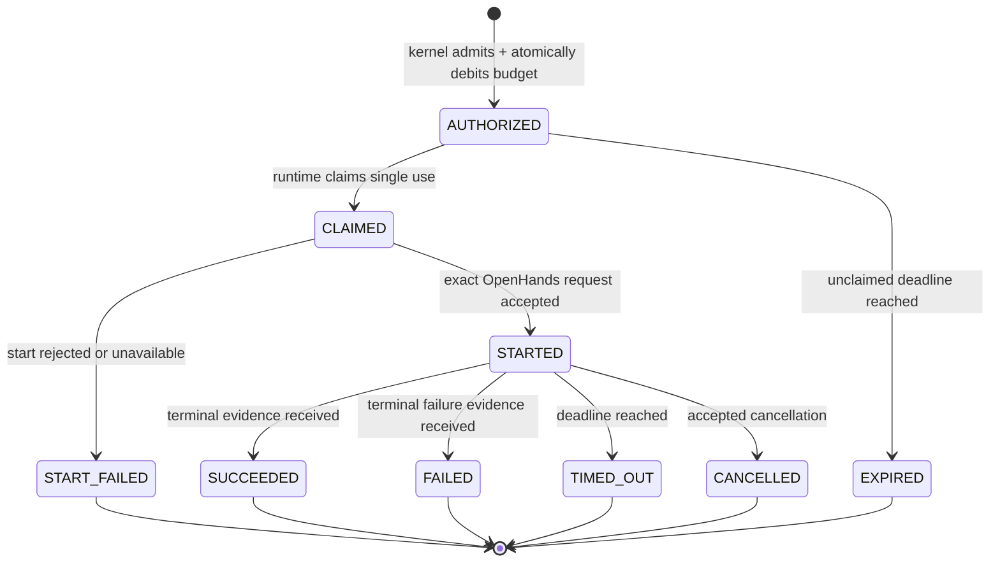
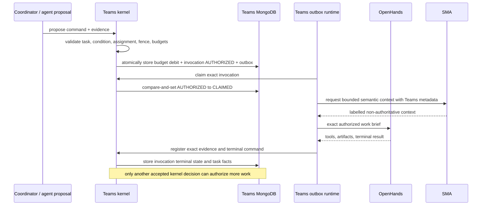

# Phase 4 Step 1 — operational runtime design closure

## Status

**Status:** `READY_FOR_PRINCIPAL_REVIEW`

This record completes the design and ownership work required by Step 1 of the
approved Phase 4 plan. It changes no accepted contract, product code, SMA code,
service, or database. Implementation begins only after this design is accepted.

The machine-readable ownership decision is
`OUTPUT/phase-4/step-1-state-ownership-matrix.json`.

## Executive decision

The operational Teams runtime will use four separate concepts:

1. the existing task and story aggregates remain the authority for work state;
2. a new Teams-owned **work budget account** supplies one inherited, hard model
   invocation ceiling for an entire root work graph;
3. a new Teams-owned **work invocation** is the only single-use authority that
   can start or resume model-backed work; and
4. MongoDB task and story projections provide operational reads but never
   authorize a transition.

OpenHands executes a work invocation. SMA supplies bounded semantic context and
retains memory. Neither an agent message nor an SMA record can create an
invocation.

This closes the infinite-conversation defect structurally. A DAG prevents a
backward graph edge, but it does not prevent an infinite forward chain. The
root work budget makes the number of model invocations finite even when agents
alternate roles, invent new message types, create child tasks, hand work off,
restart, or switch models.

## Verified current-state inventory

### Teams

- **OBSERVED:** contract `0.7.0` defines story and task commands/events,
  ownership, work-profile binding, qualified assignment, dispatch, completion,
  review, escalation, release, and evidence records.
- **OBSERVED:** `kernel.FiniteWorkBudgets` currently contains attempt, review,
  promotion, escalation, and deadline limits. It has no graph-wide model-call
  limit, child-task limit, handoff limit, or replan limit.
- **OBSERVED:** the generic attempt evaluator applies a limit only when a
  command type is present in the authorization policy's `attempt_limits` map.
  An absent entry is not a universal execution prohibition.
- **OBSERVED:** the kernel validates causal parents and DAG edges, but no record
  represents a single-use model invocation.
- **OBSERVED:** qualified assignment binds a task/profile to an actor,
  execution fence, model profile, runtime identity, policy, qualification, and
  evidence. It does not bind one invocation purpose, one output predicate, an
  invocation ordinal, or permit consumption.
- **OBSERVED:** the Mongo adapter stores authoritative aggregates/events plus
  specialized records including work profiles, qualified assignments,
  executions, reviews, escalations, evidence, budgets, receipts, outbox
  records, and consumer checkpoints. It has no task or story read projection.
- **OBSERVED:** task creation event payloads retain title, description,
  acceptance criteria, story relationship, and dependencies, while the compact
  aggregate snapshot does not retain all of those display fields.
- **OBSERVED:** the current execution coordinator controls actor process
  identity and fencing. It is not a task/model invocation coordinator.

### SMA programming adapter

- **OBSERVED:** `AgentMemoryWorktree` and `AgentMemoryEntry` hold bounded,
  task-local working memory such as observations, hypotheses, attempts,
  artifacts, and outcomes. They do not need to become Teams workflow state.
- **OBSERVED:** exact copied Teams source events are retained with contract and
  provenance identity. These are evidence mirrors, not lifecycle authority.
- **OBSERVED:** programming session manifests record SMA delivery bookkeeping.
- **OBSERVED:** `SharedProjectWorkingEntry` can store task ownership, writable
  path leases, active worktrees, blockers, interface contracts, review state,
  and operational conditions.
- **OBSERVED:** `ProgrammingAdapterRepository` exposes `acquireLease`,
  `renewLease`, and `releaseLease`, and its Mongo implementation arbitrates
  active conflicts. Production searches found no caller outside repository
  tests, but the authority-capable interface exists.
- **OBSERVED:** an OpenHands programming source event may carry an arbitrary
  coordination key, kind, and fact map. `ProgrammingEventLifecycleService`
  publishes that map into shared working state.
- **OBSERVED:** the Teams adapter currently maps exact Teams blocked/unblocked
  events into shared blocker entries. That is a read-only mirror of Teams fact.
- **OBSERVED:** the accepted Teams/SMA alignment design already states that SMA
  must not classify, route, assign, complete, release, suspend, or resume work.

### Derived problem statement

- **COMPUTED:** a valid acyclic chain `A1 -> B1 -> A2 -> B2 -> ...` can grow
  without bound. DAG validation alone therefore does not prove termination.
- **COMPUTED:** role, actor, model, process, message type, child-task, and
  handoff identities cannot be allowed to own independent replenishable
  budgets; otherwise the same conversational loop can rename itself and
  continue.
- **INFERRED:** the uncomposed SMA lease API is not causing current live
  scheduling behavior, but leaving it authority-capable would create two
  plausible owners when Phase 4 becomes operational.

## Closed ownership model

### Teams canonical state

Teams is the only write authority for:

- story and task definitions, scope, criteria, dependencies, and DAG edges;
- lifecycle, phase, condition, blocking, ownership, writable-path leases,
  worktree assignment, review state, and current operational constraints;
- work-risk profile, selected decision route, actor, execution fence, model,
  runtime, qualification, and assignment;
- graph-wide and task-local budgets, counters, deadlines, and amendments;
- invocation authorization, consumption, terminal result, retryability, and
  cancellation;
- evidence registration, findings, review, escalation, completion, acceptance,
  and release; and
- every fact used to decide whether work may run next.

### OpenHands execution-local state

OpenHands owns only disposable execution mechanics:

- provider conversation and event IDs;
- live process/session status;
- terminal, tool, stdout/stderr, and workspace receipts;
- unsaved scratch reasoning and task-local notes; and
- the mechanics of applying the exact authorized work brief.

OpenHands may submit evidence and commands for Teams evaluation. It cannot
authorize another invocation.

### SMA state

SMA owns:

- semantic memories, interpretations, relationships, provenance,
  contradictions, supersession, and retrieval/disclosure records;
- task-local AMW material used as bounded working memory;
- programming delivery manifests and memory-promotion bookkeeping; and
- immutable copies of exact Teams events used as provenance-bearing evidence.

SMA may return a suggestion, recalled fact, or difficulty observation. Teams
must register/evaluate it before it can affect current work.

### Required SMA boundary correction

Phase 4 does not alter SMA during Step 1. Step 6 must apply these interface
corrections, coordinated with the SMA project:

1. lease acquire/renew/release moves to Teams; SMA may retain only an exact
   read-only lease reference supplied by a Teams event;
2. shared entries for task ownership, writable paths, blockers, review state,
   operational conditions, and current interface constraints become Teams
   projections or read-only SMA mirrors derived exclusively from exact Teams
   events;
3. OpenHands-originated coordination maps are treated as task-local evidence or
   proposals and cannot update the shared authoritative view;
4. `ACTIVE_WORKTREE` in SMA is a context label only; the live execution and
   workspace record in Teams is authoritative; and
5. the phrase "system of record" in the programming adapter is narrowed to SMA
   adapter/memory records and cannot include organizational state.

No memory semantics, embedding path, cognition path, or retrieval algorithm
needs to change for this boundary correction.

## Invocation and termination design

### 1. Root work budget account

Every executable story/task graph has one `work_budget_account_id`, rooted in
the first executable story or task lifecycle. Its immutable identity binds:

- root work ID and kind;
- lifecycle epoch and policy revision;
- current budget revision and deadline;
- hard `model_invocation_limit` and used count; and
- purpose-specific limits and used counts.

Required purpose dimensions are:

- `INVESTIGATION`;
- `IMPLEMENTATION`;
- `VALIDATION`;
- `REVIEW`;
- `REPAIR`;
- `HANDOFF`;
- `REPLAN`;
- `PROMOTION`; and
- `ESCALATION`.

Child tasks inherit the same account. They may receive a sub-allocation, but a
sub-allocation reserves capacity from the existing root limit and cannot mint
capacity. Process replacement, actor replacement, model promotion, restart,
handoff, review correction, or a new message type does not change the account.

The existing work-profile attempt/review/promotion/escalation limits remain
useful task-level constraints. The successor contract adds the graph-wide hard
limit and the missing loop-capable purpose limits. A missing applicable limit
fails closed.

For a frozen work graph and policy:

```text
remaining_model_invocations =
    root.model_invocation_limit - root.model_invocations_used

maximum_additional_model_invocations =
    max(0, remaining_model_invocations)
```

Purpose limits can only reduce this maximum. Across independent root graphs,
the conservative maximum is the sum of their remaining root limits. This is a
computable termination proof; it does not depend on agent cooperation.

An operator may amend a budget only through an explicit versioned Teams command
with authority, reason, evidence, old/new limits, and a new budget revision.
That changes the frozen policy and is visible; it is not an implicit reset.

### 2. Work invocation aggregate

Introduce one first-class `work_invocation` aggregate. `task.dispatch` retains
its current meaning as an accepted assignment/dispatch fact, but it is not an
executable wakeup by itself. Only an accepted invocation authorization can
produce the executable outbox record.

An invocation authorization binds:

- invocation ID and idempotency key;
- task, root work budget account, lifecycle epoch, scope revision, expected task
  revision, and exact DAG parent event;
- work-profile and qualified-assignment identities;
- purpose and attempt family;
- actor FQN, execution ID, fencing epoch, model-profile digest, runtime digest,
  and workspace scope;
- condition digest, evidence predicate, allowed tools/effects, output contract,
  retry policy, terminal policy, and deadline;
- global and purpose-specific debit ordinals plus remaining counts; and
- the exact authority and policy revision that admitted it.

The record has the following state machine:



`AUTHORIZED -> CLAIMED` is compare-and-set and single-use. Claiming again,
claiming with a stale task/profile/fence/runtime identity, or starting after
expiry fails closed. Budget debit and invocation authorization are committed in
one Teams transaction before an outbox wakeup exists. Failure to deliver or
start does not silently refund the debit; an explicit policy decision is
required.

### 3. Progress and legitimate retry

The kernel computes a `condition_digest` from authoritative state:

- task/lifecycle/scope/work-profile/assignment revisions;
- current acceptance and evidence-predicate results;
- current findings, blockers, and operational constraints;
- exact relevant artifact/evidence digests; and
- invocation purpose.

Actor name, role label, model name, provider, channel, conversation, process,
and message type are deliberately excluded. Changing those names is not
progress.

The first invocation for a condition may be authorized when required by the
accepted task state. A later invocation for the same condition requires an
accepted predecessor terminal record whose outcome is explicitly retryable,
plus the next retry ordinal and remaining root/purpose/task budget. New evidence
or an accepted task/review/blocker transition produces a new condition digest.

Thus a valid transient retry remains possible, while an agent cannot continue
merely by asking again. The kernel rejects:

- the same condition with no accepted predecessor terminal state;
- an unapproved non-retryable result;
- a repeated retry ordinal;
- an exhausted or missing budget;
- a stale revision, lifecycle, profile, assignment, fence, model, runtime, or
  deadline; and
- any attempted wakeup not caused by an invocation authorization event.

### 4. The only wakeup path



Generic task events, message delivery, MongoDB change streams, OpenHands output,
and SMA output may wake their own consumers for observation. They cannot wake a
model. The model-execution consumer listens only for the executable invocation
outbox kind and must claim the exact permit first.

## Teams MongoDB projections

The successor design fixes these collection names:

- `story_projections`;
- `task_projections`; and
- `projection_checkpoints`.

The authoritative collections remain `events`, `aggregates`, and the existing
specialized Teams records. Projections are read-only outputs.

### Story projection

Each story document contains:

- story identity, title, description, acceptance criteria, and task IDs;
- aggregate revision, lifecycle epoch, scope revision, phase, and condition;
- dependency/join summary;
- task counts by phase/condition;
- current completion, acceptance, and release summary;
- current blocker/escalation summary; and
- last applied event ID, aggregate revision, projection revision, and source
  contract identity.

### Task projection

Each task document contains:

- task/story identity, title, description, acceptance criteria, scope, and
  dependency IDs;
- aggregate revision, lifecycle epoch, scope revision, phase, and condition;
- current owner, ownership version, writable-path/worktree assignment, and
  blockers;
- complete current work-risk profile plus an optional policy-versioned derived
  display score;
- root budget account, hard and purpose limits, used/remaining counters, and
  deadline;
- qualified assignment and exact actor/execution/fence/model/runtime identity;
- latest invocation state and invocation counts by purpose/outcome;
- current validation, findings, escalation, completion, and acceptance summary;
  and
- last applied event ID, aggregate revision, projection revision, and source
  contract identity.

### Projection correctness

The projector applies accepted events in aggregate-revision order:

- the next revision is exactly prior revision plus one;
- exact duplicate event ID and digest is a no-op;
- a duplicate revision with different identity/content is a conflict;
- a revision gap stops that aggregate projection and records the gap;
- the checkpoint advances only after the projection write is durable;
- rebuilding into new temporary collections starts from revision zero, validates
  every transition, compares canonical documents with the incremental views,
  and swaps only after exact agreement; and
- no kernel decision reads a projection as authority.

Task/story creation payloads supply descriptive fields. Later domain events and
the new budget/invocation events supply operational fields. The design does not
copy mutable SMA records into these views.

## Compatibility impact

- Contract `0.7.0` remains immutable and accepted.
- Step 2 should create contract `0.8.0` because new first-class aggregates,
  commands, events, schemas, mandatory limits, and wakeup semantics are
  introduced.
- Existing `task.dispatch` and its event remain valid historical facts but are
  explicitly non-executable under the Phase 4 runtime.
- Existing actor execution fencing remains intact and is referenced by each
  invocation; actor-process execution and task invocation are not merged.
- Existing work profiles remain readable. A `0.7.0` profile must receive an
  explicit successor budget binding before it can authorize Phase 4 execution;
  missing graph-wide limits fail closed.
- Existing Teams event export remains useful for SMA provenance. No new SMA
  workflow-authority endpoint is introduced.
- No v3 data is migrated in this phase.

## Step 2 implementation contract

After principal acceptance, Step 2 will create the immutable `0.8.0` contract
package with:

1. `work_budget_account` and `work_invocation` aggregate schemas;
2. commands/events for budget creation/amendment/allocation, invocation
   authorization/claim/start/terminal/expiry/cancellation, and projection gap or
   conflict evidence;
3. mandatory missing-budget and single-use semantics;
4. compatibility rules from `0.7.0`;
5. the projection schemas above;
6. Teams/SMA boundary invariants; and
7. positive and negative fixtures covering legitimate retries and every known
   budget-reset or message-co-option path.

No accepted `0.7.0` file will be edited.

## Step 1 exit adjudication

- **OBSERVED:** every identified task, story, assignment, execution, working
  memory, shared state, and lease category now has one declared authority.
- **COMPUTED:** for a frozen root budget, the number of additional model calls
  is bounded by the non-negative remaining root invocation count.
- **COMPUTED:** child creation, handoff, replan, restart, promotion, actor/model
  replacement, or message-type substitution cannot increase that bound under
  this design.
- **INFERRED:** implementing the exact design will make the v3-style
  back-and-forth failure structurally impossible unless an authorized operator
  explicitly versions and increases the root budget.

**Recommendation:** `ACCEPT` Phase 4 Step 1 and authorize Step 2 contract
`0.8.0` construction. No product implementation should precede that accepted
contract.
